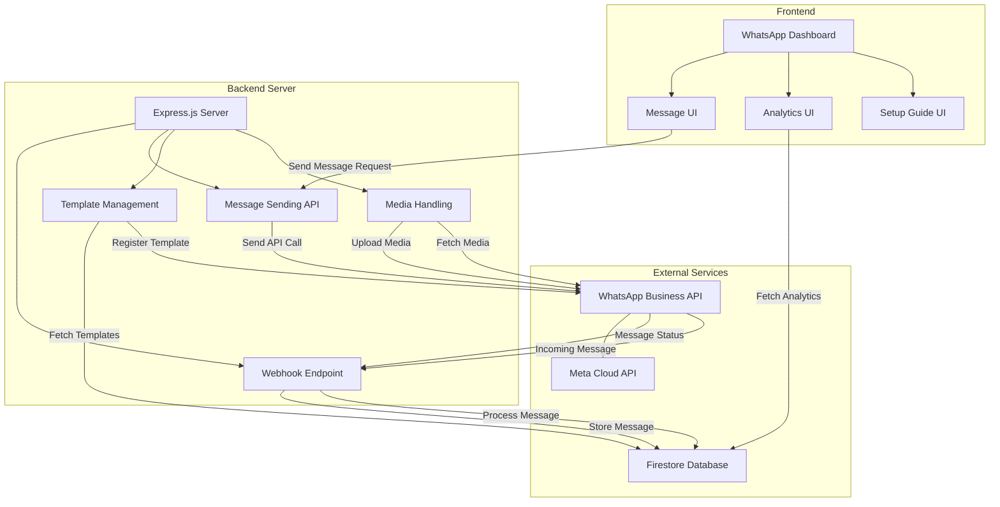

# WhatsApp Integration Architecture Diagram

## Component Description

### Frontend Components

- **WhatsApp Dashboard**: Main interface for WhatsApp functionality
- **Message UI**: Interface for sending and receiving messages
- **Analytics UI**: Interface for viewing message metrics
- **Setup Guide UI**: Documentation for setting up WhatsApp integration

### Backend Components

- **Express.js Server**: Main server handling API requests
- **Webhook Endpoint**: Receives events from WhatsApp Business API
- **Message Sending API**: Sends messages to WhatsApp Business API
- **Template Management**: Manages message templates
- **Media Handling**: Handles media uploads and downloads

### External Services

- **WhatsApp Business API**: Meta's WhatsApp Business API
- **Meta Cloud API**: Cloud API for WhatsApp Business
- **Firestore Database**: Database for storing messages and templates

## Data Flow

1. **Sending a Message**:
   - User inputs message in Message UI
   - Request sent to Message Sending API
   - API call made to WhatsApp Business API
   - Message status received via Webhook
   - Status stored in Firestore Database

2. **Receiving a Message**:
   - Customer sends message via WhatsApp
   - WhatsApp Business API sends event to Webhook
   - Webhook processes message
   - Message stored in Firestore Database
   - Message displayed in Message UI

3. **Analytics**:
   - Analytics UI requests data
   - Data fetched from Firestore Database
   - Metrics calculated and displayed

4. **Template Management**:
   - Templates created/updated in Template Management
   - Templates registered with WhatsApp Business API
   - Templates stored in Firestore Database

## Security Considerations

- All API calls authenticated with access token
- Webhook verified with verify token
- Sensitive data stored in environment variables
- HTTPS used for all communications
- Role-based access control for admin functions

## Scaling Considerations

- Message queue for high-volume scenarios
- Asynchronous processing for webhook events
- Rate limiting to avoid API limits
- Caching for frequently accessed data
- Horizontal scaling of backend services
